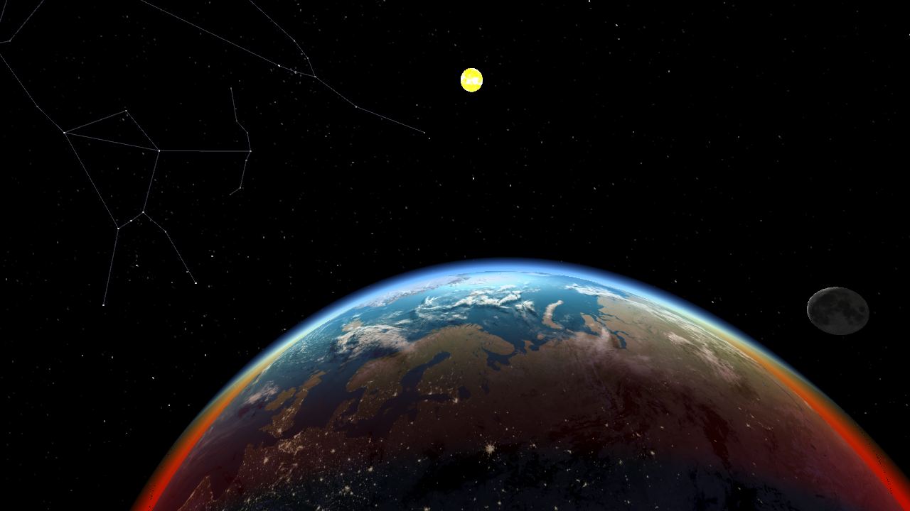

# TDT4230 Project

Repository containing my project for the course TDT4230, about earth and stars rendering using OpenGL. More information about compiling for windows and dependencies (submodules) are found in the readme for base project: https://github.com/aleksaro/gloom.

## Download

``git clone --recurse-submodules https://github.com/senbon/gloom.git``

If you have already cloned the repository and missed the ``--recurse-submodules`` flag, then the following grabs all dependencies.

``git submodule update --init``

## Compilation on Linux

Navigate into the build folder:

``cd TDT4230-Project/build``

Generate UNIX Makefile (point CMake to CMakeLists.txt):

``cmake ..``

Build and link all files:

``make``

and run executable:

``./gloom/gloom``

### High resolution textures

High resolution textures are not included in the repository due to file size (about 20MB each for 8K textures). They can be downloaded from http://www.shadedrelief.com/natural3/index.html. Run with

``./gloom/gloom hires``

to load high resolution textures instead of the standard ones.

### Star catalog

The star catalog is from http://astronexus.com/node/34

TODO: they are also hosted on github, add it as submodule.

#### Links

Glitter: https://github.com/Polytonic/Glitter
NTNU: https://www.ntnu.edu/
glad: https://github.com/Dav1dde/glad
glfw: https://github.com/glfw/glfw
glm: https://github.com/g-truc/glm
stb: https://github.com/nothings/stb
CMake: https://cmake.org/
gloom repository wiki: https://github.com/senbon/gloom/wiki
